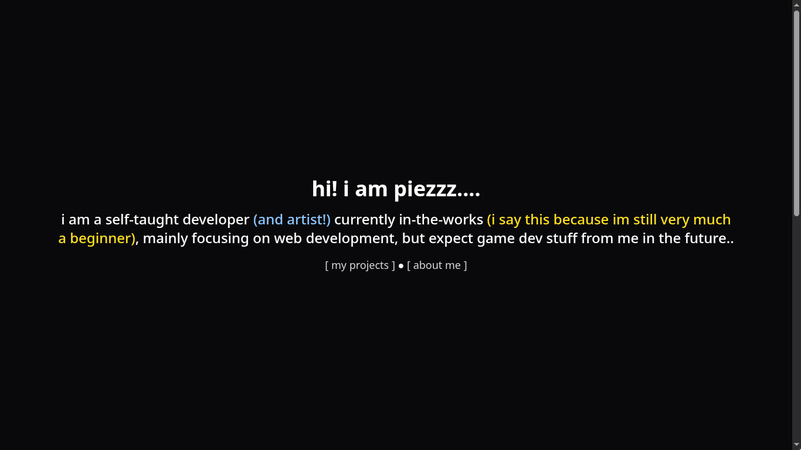

# Personal Site!

A complete remake of my website, containing introduction, projects, and about me using React/Tailwind CSS!
<br>


[Try it out!](https://dumpiez.com)

---

## Features

- Introductions Section
- Projects Section
- About Me Section
- Responsive Web Design

## How to run locally

### Prerequisites

- NodeJS: `v20.19.0` or higher
- npm: `11.17.0` or higher
- Git: For version control

### Steps

1. Clone the Repository:

```sh
git clone https://github.com/dumpiez/personal-site
cd personal-site
```

2. Install the dependencies:

```sh
npm install
```

### Running the Application

Start the local development server using:

```sh
npm run dev
```

Once the server starts, head over to https://localhost:5173 or any other local URl specified in your terminal

## Credits and Acknowledgements

1. [placehold.co](https://placehold.co/)
2. [Tailwind Docs](https://tailwindcss.com/docs)
3. [Hack Club ❤️](https://hackclub.com)
